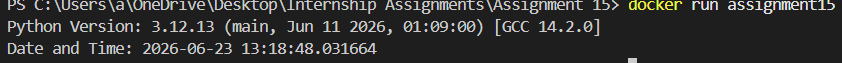

# Docker Python Program

# Description

This Project Simply Prints the version of python in the docker container and current Time

# Steps

- made 2 files: assignment.py and Dockerfile
- assignment.py contains the code
- Dockerfile Contains the dependencies like python:3.12-slim
- Build the Image using: docker build -t assignment15.
- Run the Image: docker run assignment15

# Sample Output Image

